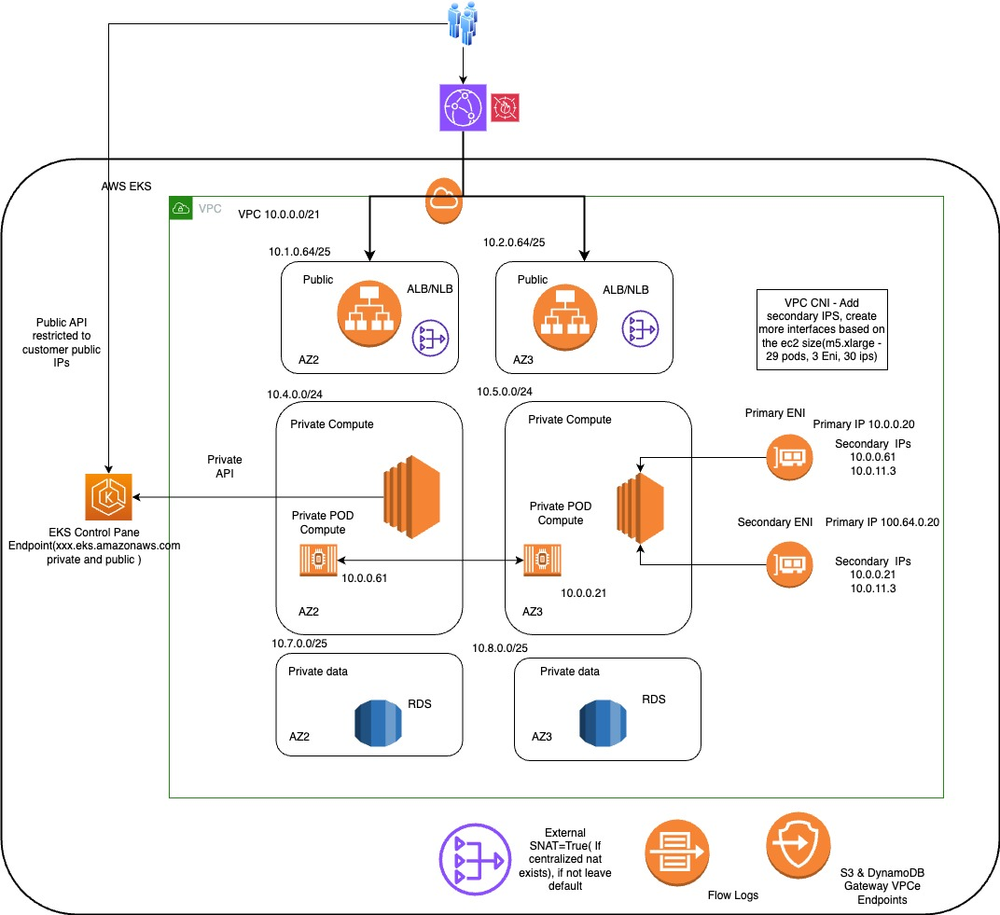
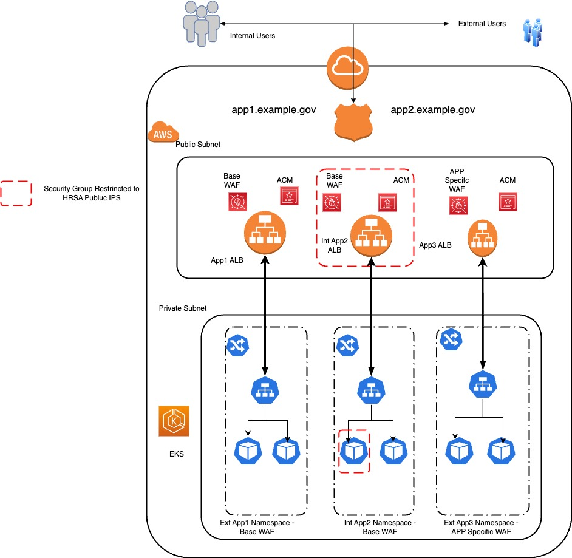
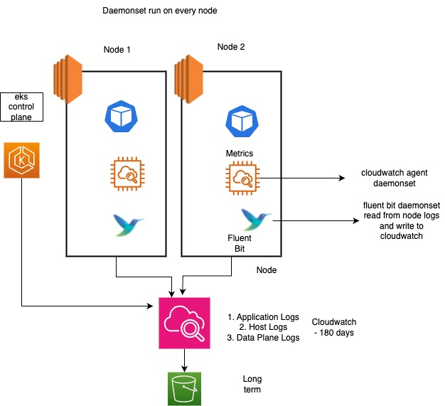

# EKS Pattern for Enterprises

This pattern deploys reusable EKS Terraform code across multiple accounts. It assumes the customer has a predefined VPC with the following subnets: Public, Private, Data, and routing to the internet.

## Overview

This repository contains EKS deployment code in Terraform. This code deploys an EKS Cluster, EKS Managed nodes, EKS Addons, and Karpenter to scale nodes.



## EKS Cluster

1. Deploy EKS Cluster in private subnets
2. EKS Endpoint is accessible for private and public networks
3. Communication between Node and EKS will be private
4. Cluster is encrypted with KMS CMK
5. Platform Admin Role for cluster access by platform admins
6. Developer role with read-only access to cluster and admin access to namespace
7. App Admin role for cluster access by app admins
8. EKS Managed Nodes
9. IAM roles 
10. Security groups for Nodes and accessing cluster from public
11. Cluster Addons:
    - CoreDNS
    - Kube-proxy
    - EKS-pod-identity-agent
    - VPC CNI (SNAT is false)

## EKS Addons

| Addon | Purpose |
|-------|---------|
| AWS EBS CSI | Store persistent data in AWS EBS volumes |
| AWS Load Balancer | Create AWS ALB, NLB, Ingress controller, and application routes |
| Metrics Server | Monitor CPU and Memory of cluster |
| CloudWatch metrics | Enable CloudWatch container insights and metrics |
| External DNS | Manage records in Route 53 |
| Cert Manager | Add certificates to ALB |
| Fluent Bit | Send pod logs to CloudWatch |
| Secrets Manager | Read AWS Secrets Manager |
| Argocd | Deploy Helm templates 

Note: ArgoCD is currently configured to use port 80 on AWS Application Load Balancer (ALB). To enable SSL on your ArgoCD installation, you'll need to make the following modifications in the eks-addons.tf file: add port 443, add your domain certificate. These changes will enable secure HTTPS access to your ArgoCD installation.

## Karpenter

Karpenter is installed using Helm. Karpenter will scale the nodes based on defined limits.

## Application Architecture

Every application has its own dedicated namespace, service account, and dedicated load balancer. Contains two pools ( System pool and Node pool). System pool is for eks addons and node pool is for application pods



## Logs and Metrics

Fluent Bit and CloudWatch metrics run as DaemonSets. They collect logs from nodes and write to CloudWatch logs.



## CI/CD Architecture

There will be two repositories:
1. **Source code repo**: Used to build Docker images and publish them to ECR Image repository
2. **Application repo**: Contains Kubernetes configuration manifest files as Helm templates

## Roles & Responsibilities

### Platform Admin/Operations
- Deploy and maintain cluster health
- Ensure ArgoCD operational status
- Manage access for Developers and App admins
- Monitor EKS cluster vulnerabilities

### Developers
- Deploy Docker images
- Maintain application code repository
- Deploy configuration files to Kubernetes
- Ensure ArgoCD integration with application repo

## Deployment Instructions

## Method 1 dpeploying using laptop

Update the tfvars/non-prod/terraform.tfvars : vpc name, cluster name etc..
Make sure subnets are created follow naming convention, so data.tf can read the values

var.vpc_name-Compute* private eks nodes will be hosted
var.vpc_name-FrontEnd* public load balabcers open to internet
var.vpc_name-Data*" private data for databases

## Using run-terraform.sh
Prerequisites is to setup backend infrastructure


EXPORT AWS Credentials 

```bash
run the ./setup-backend.sh 
```

The deployment script requires the following mandatory parameters:

Prerequisites for shell script is to create terraform state bucket and dynamodb db table following format:
- `<AWS_ACCOUNT_ID>-terraform-state` 
- `<AWS_ACCOUNT_ID>-terraform-state-lock` 

once backend configuration is complete:

```bash
./run-terraform.sh -a <ACTION> -e <ENVIRONMENT> -s <APP_NAME>


<Action> - Init, Plan
<Environment> - non-prod, prod
<App Name> - example
```

## Method 2 Deploying thru AWS Code Pipeline

EXPORT AWS Credentials 

```bash
run the ./setup-backend.sh 
```

Deployment of Code pipeline:

1. create the repository of your tool, clone the repository and update eks-accelerator code to repo
2. cd cicd
3. Update the values in `terraform.tfvars` with your specific configuration under cicd folder 

4. Initialize Terraform:

```bash
terraform init
```

5. Plan the deployment:

```bash
terraform plan
```

6. Apply the configuration:

```bash
terraform apply

7. Login into AWS console, go to codepipeline and configure pipeline point to the code repository

8. Run the Code pipeline

## Upgrade the eks cluster, addons and karpenter

Please note: perform this upgrade lower to higher environments.Test before moving to higher environment

1. Upgrade EKS cluster and run terraform apply, EKS managed node groups will be updated automatically
2. Upgrade EKS Addons and run teraform apply
3. Upgrade Karpenter and run terraform apply

If you want upgrade only eks-managed nodes, updated the eks.tf managed nodes with latest ami and terraform apply. That will upgrade only eks managed ndoes

## Deployment of application Pods

1. Please use nodeselctor to place application pods in karpenter managed node pool
    nodeSelector:
        workload: app-general